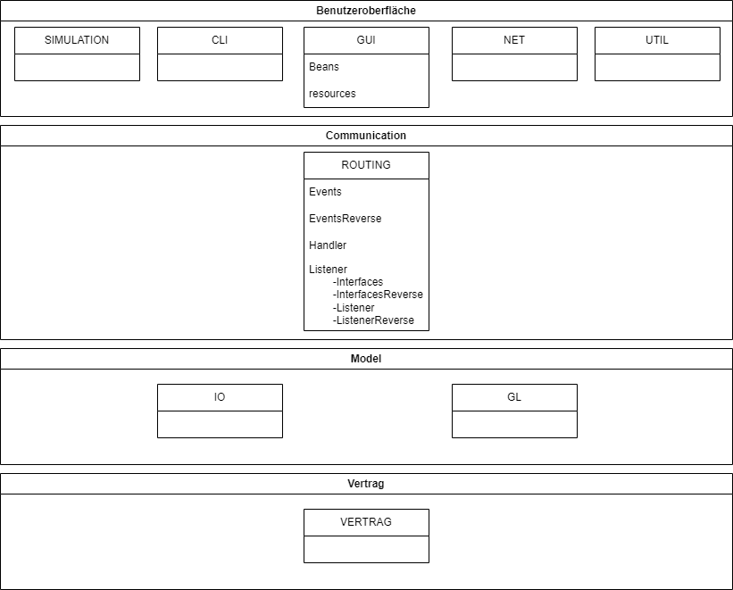

# Beleg PZR1 (94)
Checkboxen befüllen und _kursiv_ gesetzten Text durch entsprechende Angaben ersetzten.
Bei keiner Angabe wird nur Entwurf, Testqualität, Testabdeckung GL, Fehlerfreiheit und Basisfunktionalität bewertet.
Die Zahl in der Klammer sind die jeweiligen Punkte für die Bewertung.
Die empfohlenen Realisierungen zum Bestehen der Prüfung sind **fett** gesetzt.
Ergänzende Anmerkungen bitte immer _kursiv_ setzen. Andere Änderungen sind nicht zulässig.

## Entwurf (11)
- [x] **Schichtenaufteilung** (2)
- [x] **Architekturdiagramm vollständig** (1)
- [x] **Architekturdiagramm korrekt bzgl. source code** (1)
- [x] Zuständigkeit (2)
- [x] Paketierung (2)
- [x] Benennung (2)
- [ ] keine Duplikate (1)

## Tests (28)
- [x] **Testqualität** (7)
- [ ] **Testabdeckung GL** (7) _100%_
- [x] **Testabdeckung Rest** (6)
  - [x] Einfügen von Herstellern über das CLI _Cli.Console_
  - [x] Anzeigen von Herstellern über das CLI _Cli.Console_
  - [x] ein Beobachter bzw. dessen alternative Implementierung _util.ObjDatabaseObserver_
  - [ ] deterministische Funktionalität der Simulationen _getestete Klassen angeben_
  - [x] Speichern via JOS oder JBP _IO.FileSystem_
  - [x] Laden via JOS oder JBP _IO.FileSystem_
- [x] **Mockito richtig verwendet** (4)
- [x] Spy- / Verhaltens-Tests (3)
- [x] keine unbeabsichtigt fehlschlagenden Test (1)

## Fehlerfreiheit (10)
- [x] **Kapselung** (5)
- [x] **keine Ablauffehler** (5)

## Basisfunktionalität (12)
- [x] **CRUD** (2)
- [x] **CLI** (2)
  * Syntax gemäß Anforderungen
- [x] **Simulation** (2)
  * ohne race conditions
- [x] **GUI** (2)
- [x] **I/O** (2)
  * in CLI oder GUI integriert
- [x] **Net** (2)

## Funktionalität (23)
- [x] vollständige GL (2)
- [x] threadsichere GL (1)
- [x] vollständiges CLI (1)
- [x] alternatives CLI (1)
  * _Löschen von Herstellern und Auflisten der Allergene und ObjDatabaseAllergeneObserver sind deaktiviert_
- [x] skalierbare GUI (1)
- [x] vollständige GUI (1)
- [x] ausdifferenziertes event-System mit mindestens 3 events (2)
- [x] observer ^ property change propagation (2)
- [x] angemessene Aufzählungstypen (2)
- [x] Simulation 2 (1)
- [x] Simulation 3 (1)
- [x] data binding verwendet (1)
- [x] Änderung der Fachnummer mittels drag&drop (1)
- [x] Einfügen von Kuchen via GUI sperrt nicht (1)
- [x] JBP und JOS (2)
- [x] TCP und UDP (1)
- [x] Server unterstützt konkurierende Clients für TCP oder UDP (2)

## zusätzliche Anforderungen (10)
- [x] parallele Ausführung CLI und GUI (3)
- [x] Änderungen in der GUI direkt sichtbar (4)
- [x] CLI und GUI unabhängig (3)

## Architekturdiagramm

