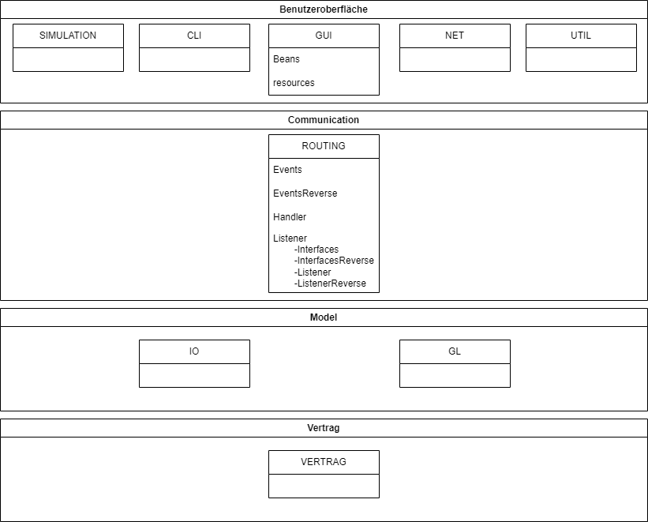

# Beleg Beispiel (94)
Checkboxen befüllen und _kursiv gesetzten Text_ durch entsprechende Angaben ersetzten.
Bei keiner Angabe wird nur Entwurf, Tests, Fehlerfreiheit und Basisfunktionalität bewertet.
Die Zahl in der Klammer sind die jeweiligen Punkte für die Bewertung.
Ergänzende Anmerkungen bitte auch _kursiv setzen_.

## Entwurf (12)
- [ ] **Schichtenaufteilung** (4)
- [ ] Architekturdiagramm (1)
- [ ] Zuständigkeit (2)
- [ ] Paketierung (2)
- [ ] Benennung (2)
- [ ] keine Duplikate (1)

## Tests (28)
- [ ] **Testqualität** (7)
- [ ] **Testabdeckung GL** (7)
- [ ] **Testabdeckung Rest** (6)
  - [ ] Einfügen von Herstellern über das CLI _getestete Klassen angeben_
  - [ ] Anzeigen von Herstellern über das CLI _getestete Klassen angeben_
  - [ ] ein Beobachter bzw. dessen alternative Implementierung _getestete Klassen angeben_
  - [ ] deterministische Funktionalität der Simulationen _getestete Klassen angeben_
  - [ ] Speichern via JOS oder JBP _getestete Klassen angeben_
  - [ ] Laden via JOS oder JBP _getestete Klassen angeben_
- [ ] **Mockito richtig verwendet** (4)
- [ ] Spy- / Verhaltens-Tests (3)
- [ ] keine unbeabsichtigt fehlschlagenden Test (1)

## Fehlerfreiheit (10)
- **Kapselung** (5)
- **keine Ablauffehler** (5)

## Basisfunktionalität (12)
- [ ] **CRUD** (2)
- [ ] **CLI** (2)
  * Syntax gemäß Anforderungen
- [ ] **Simulation** (2)
  * ohne race conditions
- [ ] **GUI** (2)
- [ ] **I/O** (2)
  * in CLI oder GUI integriert
- [ ] **Net** (2)

## Funktionalität (22)
- [ ] vollständige GL (2)
- [ ] threadsichere GL (1)
- [ ] vollständiges CLI inkl. alternatives CLI (2)
  * _angeben welche Funktionalität im alternativen CLI deaktiviert_
- [ ] vollständiges GUI (2)
- [ ] mindestens 3 events (2)
- [ ] observer ^ property change propagation (2)
- [ ] angemessene Aufzählungstypen (2)
- [ ] Simulationen 2 & 3 (2)
- [ ] data binding (1)
- [ ] drag & drop (1)
- [ ] JBP und JOS (2)
- [ ] TCP und UDP (1)
- [ ] mehrere Clients (2)

## zusätzliche Anforderungen (10)

## Architekturdiagramm

